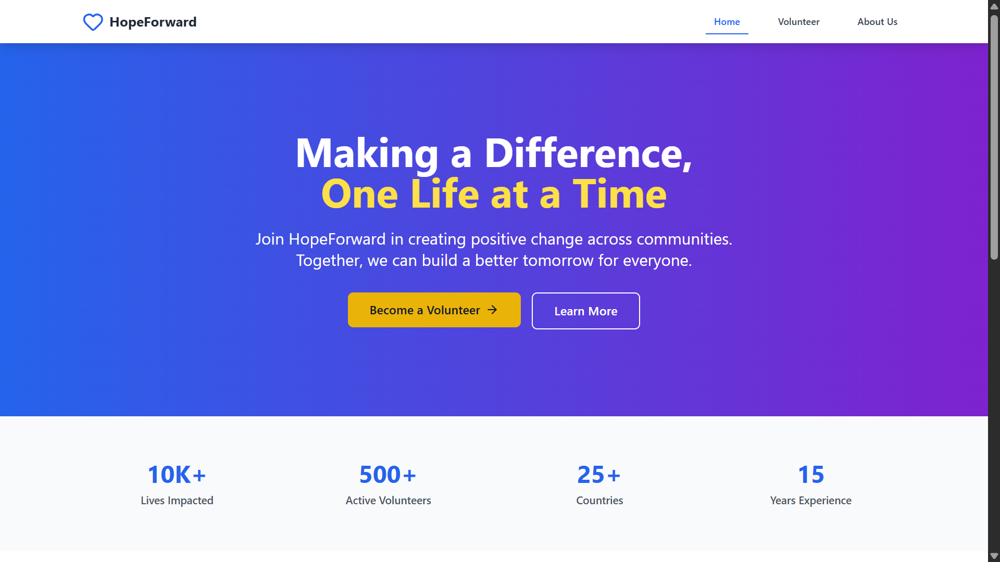
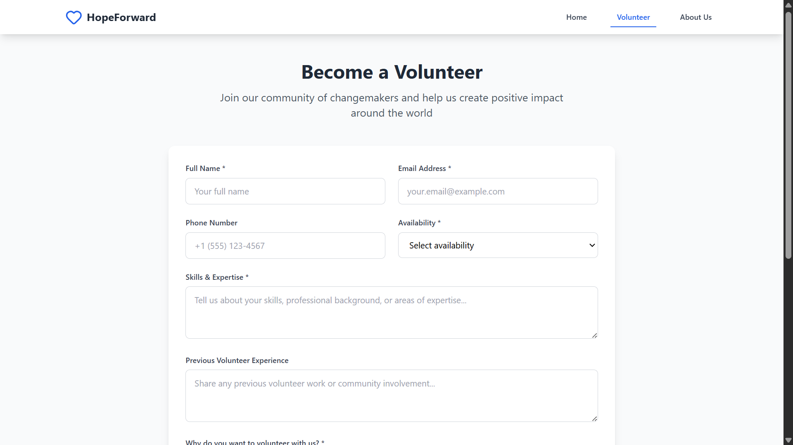
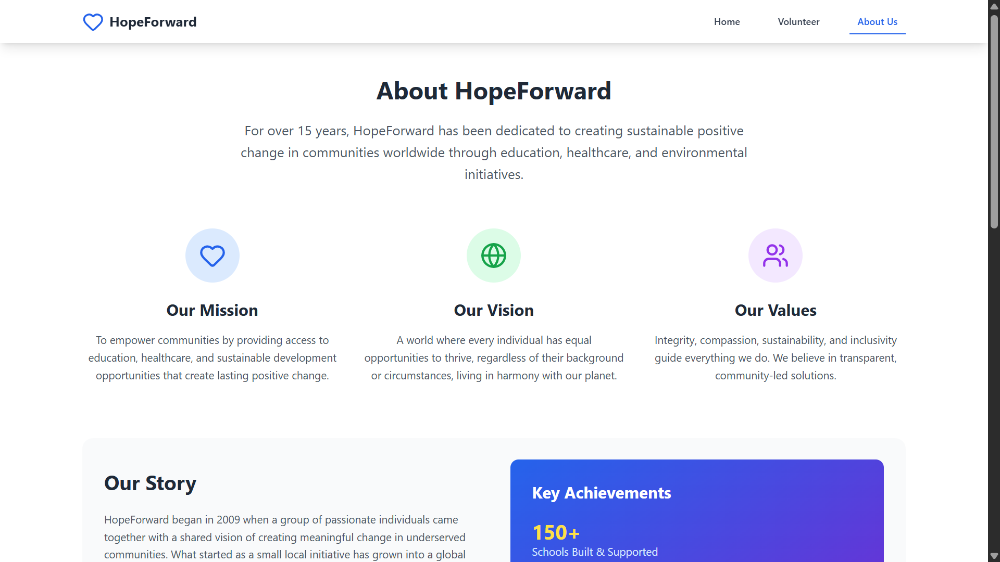

# 🌍 HopeForward — NGO Website

A modern, responsive NGO website built with **React**, **TypeScript**, and **Tailwind CSS**, featuring an elegant home page, a volunteer registration form, and an about us section.

> ✨ Live Demo: [Coming Soon on Vercel](#deployment)

---

## 📸 Screenshots

| Home Page                       | Volunteer Form                       | About Us                          |
| ------------------------------- | ------------------------------------ | --------------------------------- |
|  |  |  |

> 📷 _Add screenshots in `screenshots/` folder after deployment_

---

## 🚀 Features

- ✅ Fully responsive layout (mobile-first)
- ✅ Clean UI using **Tailwind CSS**
- ✅ Built with **React + TypeScript**
- ✅ Modal popups with contextual info
- ✅ Volunteer form with success confirmation
- ✅ Easy navigation using **React Router**

---

## 🛠️ Tech Stack

| Tech             | Description                  |
| ---------------- | ---------------------------- |
| React            | UI library                   |
| TypeScript       | Static typing                |
| Tailwind CSS     | Utility-first CSS framework  |
| React Router DOM | Client-side routing          |
| Lucide Icons     | Clean, modern SVG icons      |
| Vercel           | Deployment and CI/CD hosting |

---

## 📦 Local Development

To run the project locally:

```bash
# 1. Clone the repository
git clone https://github.com/deepakpatil26/ngo-website.git
cd ngo-website

# 2. Install dependencies
npm install

# 3. Run development server
npm run dev
```

## 📦 Deployment

To deploy the project:

1. Build the project:

```bash
npm run build
```

2. Deploy the `build` folder to your hosting provider (e.g., Vercel, Netlify, etc.).
3. For Vercel, you can connect your GitHub repository and deploy directly from there.

## Contributing

Contributions are welcome! Please open an issue or submit a pull request for any improvements or bug fixes.